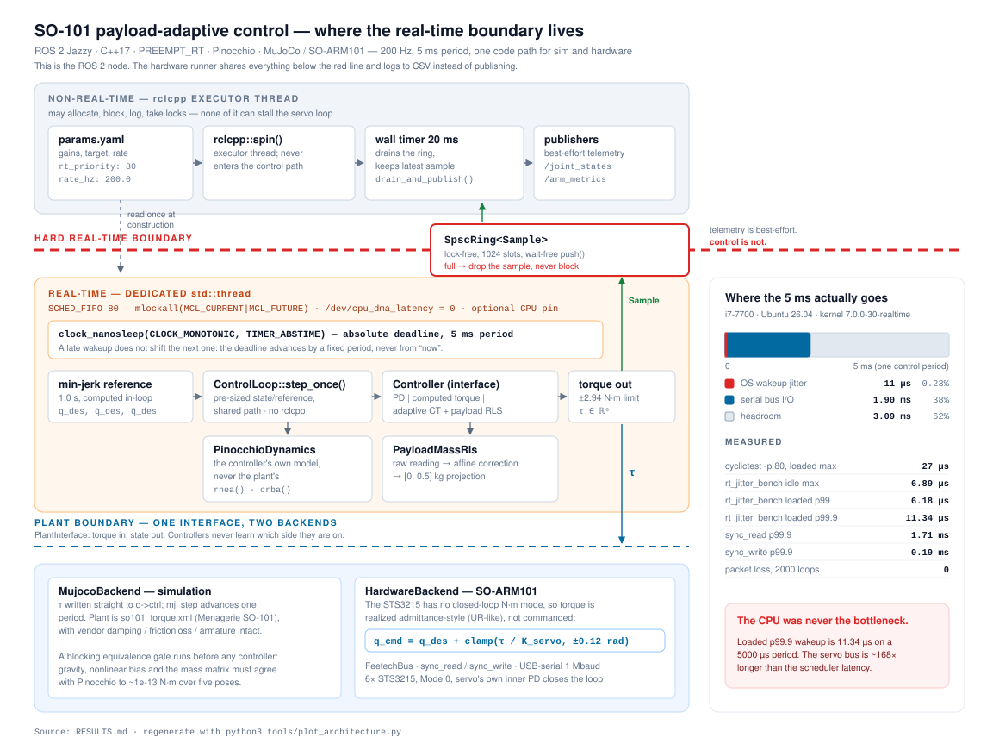
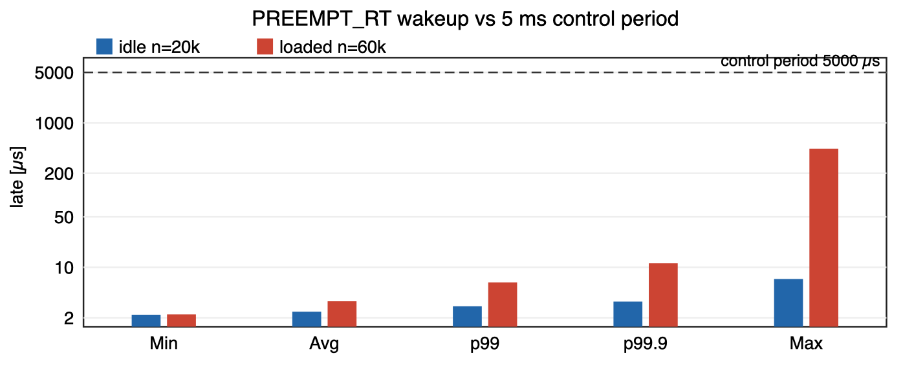
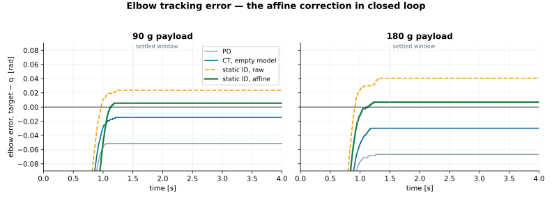

# Payload-adaptive tracking from MuJoCo to the SO-ARM101

**One C++ / ROS 2 control loop, two plants, and a measured sim-to-real gap:
the estimator that recovers payload in simulation does not transfer, so
hardware identifies mass at rest, calibrates, freezes, then tracks.**

One control loop, written once, runs against two backends behind a single
`PlantInterface`: MuJoCo in simulation, and a ThinkRobotics SO-ARM101 over a
Feetech serial bus. Controllers (PD, computed torque, adaptive computed torque
with online payload estimation) never learn which side of the plant boundary
they are on.

The current runners request `SCHED_FIFO` and `mlockall` and drive the loop at
200 Hz. The hardware tracking campaign below predates that integration — it
measures tracking, not real-time execution.

The sim-to-real gap is the substance of the project. Online payload RLS recovers
**102.4% of the empty-model-to-perfect-model computed-torque RMS gap in
simulation**. On hardware the same estimator returns **0.8 g of a 90 g payload
and 9.4 g of a 180 g one** (799 updates) and tracks like the empty model. The
failure comes from coupled measurement and actuator-model mismatches that
controller-gain tuning alone does not fix. The hardware path is therefore a
different estimator: identify the mass statically from motor current at rest,
calibrate the instrument, freeze it, then track. Applying that correction inside
the controller cuts the elbow's steady-state offset by **78–83%** and the arm RMS
excluding wrist-roll by **49–55%** versus the same static ID without calibration.

---

## Contents

- [Headline results](#headline-results)
- [Architecture and the real-time boundary](#architecture-and-the-real-time-boundary)
- [Full metrics table](#full-metrics-table)
- [The sim-to-real finding, and what closed it](#the-sim-to-real-finding-and-what-closed-it)
- [What this does not claim](#what-this-does-not-claim)
- [Build and run](#build-and-run)
- [Repository layout](#repository-layout)
- [License](#license)

---

## Headline results

One comparison per row. Each states the controller it is measured against, so
no figure floats against an unnamed baseline.

| # | Setting | Baseline → result | settled arm RMS [rad] | payload mass estimate |
|---|---|---|---|---|
| 1 | **sim**, 0.20 kg, known to the model | naive PD → computed torque | `0.0216` → `0.0028` (**−86.9%**) | not estimated — given to the model |
| 2 | **sim**, 0.20 kg, unknown | CT with empty model → CT + online RLS | `0.0154` → `0.0025` (**−83.4%**) | `0.2023` kg (**+2.3 g**) |
| 3 | **hardware**, 90 g | naive PD → CT with empty model | `0.0268` → `0.0093` (**−65%**) | not estimated — model stays empty |
| 4 | **hardware**, 180 g | naive PD → CT with empty model | `0.0356` → `0.0177` (**−50%**) | not estimated — model stays empty |
| 5 | **hardware**, 90 g | CT with empty model → CT + calibrated static ID | `0.0093` → `0.0064` (**−31%**) | none → `0.0828` kg (**−7.2 g**) |
| 6 | **hardware**, 180 g | CT with empty model → CT + calibrated static ID | `0.0177` → `0.0097` (**−45%**) | none → `0.1760` kg (**−4.0 g**) |

Row 2 is the sim result stated as a recovery: RLS closes **102.4%** of the RMS
gap between the empty-model controller and the perfect-model bound (`0.0028`).
End-effector miss follows the same pattern in simulation — `0.0300` → `0.00018` m
on row 1, `0.0209` → `0.00065` m on row 2 — and is tabulated in full below.
Hardware has no Cartesian equivalent: `kTarget` is a joint-space goal.

Rows 3–6 chain: PD → computed torque with an empty model → computed torque with
an identified payload. Rows 5–6 are the headline hardware result, measured
against the best controller that does *not* estimate the payload.

Calibration is what makes the estimate usable, not merely better. The same
static ID left uncalibrated reads `0.1813` kg at 90 g — a 91 g over-estimate —
and tracks at `0.0127` rad, **worse than not compensating at all** (row 3's
`0.0093`). Feeding a biased mass into an otherwise correct model actively hurts;
the affine correction is what turns it into row 5.

Aggregators differ between the two plants and are stated in each section: sim is
the arithmetic mean of five per-joint settled RMS values including wrist-roll,
hardware is the pooled RMS of the four joints excluding it. Sim and hardware rows
are therefore comparable only within a plant, not across.

**Real-time and bus** (separate benches, not tracking runs): loaded wakeup jitter
p99 **6.18 µs**, p99.9 **11.34 µs** on a 5000 µs period; serial round-trip
**~2.14 ms**, ~189× the scheduler latency, 38–43% of the period.

Every number above is measured on this repo's code. Full derivation, discarded
runs, and caveats are in **[RESULTS.md](RESULTS.md)**, which is the source of
truth — this README summarises it.

---

## Architecture and the real-time boundary



The figure shows the ROS 2 node. The hardware runner is a separate binary that
shares everything below the red line — the same `ControlLoop`, controllers and
`PlantInterface` — but has no executor, ring or publishers; it logs to CSV.

The diagram shows **which code is allowed to block, and which is not.**

**Above the line** — the `rclcpp` executor thread. It may allocate, log, take
locks and publish. It runs a 20 ms wall timer that drains telemetry and publishes
`/joint_states` and `/arm_metrics`. Parameters are read once, at construction.

**The line itself** — a lock-free single-producer/single-consumer ring
(`SpscRing<Sample>`, 1024 slots). The RT thread's `push()` is wait-free and
*drops* the sample when the consumer falls behind. Telemetry is best-effort;
control is not. This queue is the only thing that crosses.

**Below the line** — the control thread, which requests `SCHED_FIFO` 80 with
`mlockall(MCL_CURRENT|MCL_FUTURE)`, `/dev/cpu_dma_latency = 0` and an optional
CPU pin. Its period comes from `clock_nanosleep(CLOCK_MONOTONIC, TIMER_ABSTIME)`
— an absolute deadline, so a late wakeup does not accumulate.
`ControlLoop::step_once()` reuses pre-sized Eigen buffers and never touches
`rclcpp`; backend work is described separately below.

**What the backend does inside that iteration differs, and the difference is
real.** MuJoCo writes torque to `d->ctrl` and returns — no I/O at all. The
hardware backend must talk to a serial bus, so every iteration performs one
blocking `sync_read` then one blocking `sync_write`, together ~2.14 ms of the
5 ms period. That I/O is inherent to the plant, not an artefact. Request and
command buffers are reused, and the receive decoder processes payload bytes
without heap scratch. `sync_read` and `sync_write` each have their own
transaction deadline (2.5 ms / 0.75 ms), and both are also capped by the
remaining 5 ms control period so a slow read cannot leave a full extra budget
for the write. Writes `ppoll()` for buffer space and wait until `TIOCOUTQ == 0`
(kernel queue drained into the USB stack, not wire-time) — no busy-spin, no
unbounded `tcdrain()`. Run-health counters report stale reads, failed writes,
truncated commands, bridge saturations and missed deadlines.

**Below that** — `PlantInterface`, one abstraction with two backends. MuJoCo
writes torque straight to `d->ctrl`. On hardware the STS3215 has no closed-loop
N·m mode, so torque is realized admittance-style rather than commanded:

```
q_cmd = q_des + clamp(τ / K_servo, ±0.12 rad)
```

This is a project-specific torque-to-position bridge, not a claim of equivalence
to any vendor's internal controller.

### What the RT measurement shows

The loaded RT bench measures 6.18 µs p99 and 11.34 µs p99.9 wakeup latency on a
5000 µs period. At p99.9, the combined serial transaction (2.14 ms) is **~189×
longer than the scheduler latency.** Measuring both locates the bottleneck: not
the CPU. Today's 2.14 ms round-trip does not fit a 1 kHz (1 ms) loop; whether
cutting per-servo Return Delay Time would is untested.

Regenerate the figure with `python3 tools/plot_architecture.py`.

---

## Full metrics table

### Simulation — MuJoCo SO-101, 200 Hz, 1.0 s minimum-jerk reference

Settled window `t ≥ 1.5 s`; arm RMS is the **arithmetic mean** of the five
per-joint settled RMS values (gripper excluded). Hardware below uses a different
aggregator — see that section. Actuator limits are the real STS3215 envelope
(±2.94 N·m), not widened to make a controller work.

| # | Payload | Controller | Model knows payload? | Settled arm RMS [rad] | EE miss [m] | Peak τ [N·m] |
|---|---|---|---|---|---|---|
| 1 | empty | naive PD | — | `0.009959` | `0.014012` | — |
| 2 | empty | computed torque | n/a | `0.002933` | `0.000327` | 1.360 |
| 3 | 0.10 kg | computed torque | **no** | `0.008030` | `0.010438` | 1.640 |
| 4 | 0.10 kg | CT + payload RLS | estimated | `0.002494` | `0.000877` | 1.637 |
| 5 | 0.20 kg | naive PD | — | `0.021612` | `0.029999` | — |
| 6 | 0.20 kg | computed torque | **no** | `0.015351` | `0.020944` | 1.917 |
| 7 | 0.20 kg | CT + payload RLS | estimated | `0.002545` | `0.000646` | 1.919 |
| 8 | 0.20 kg | computed torque | **yes** (upper bound) | `0.002840` | `0.000184` | 1.923 |

Deltas, each against a named reference row:

| Comparison | Reference | Arm RMS | EE miss |
|---|---|---|---|
| Computed torque removes gravity droop, empty arm | 2 vs 1 | **−70.5%** | **−97.7%** |
| Computed torque removes gravity droop, known 0.20 kg | 8 vs 5 | **−86.9%** | **−99.4%** |
| Cost of an unmodelled 0.20 kg payload | 6 vs 2 | **5.2× worse** | **64× worse** |
| RLS recovers it, 0.10 kg | 4 vs 3 | **−68.9%** | **−91.6%** |
| RLS recovers it, 0.20 kg | 7 vs 6 | **−83.4%** | **−96.9%** |
| **RLS gap recovery toward the perfect-model bound, 0.20 kg** | (6−7)/(6−8) | **102.4%** | **97.8%** |

The 102.4% slightly exceeds 100% because the residual Coulomb-friction deadband
differs between trajectories. It is not evidence that an estimated model beats
perfect knowledge.

Mass identification in simulation:

| Plant mass [kg] | Raw estimate [kg] | Empty-bias corrected [kg] | Error | Convergence [s] |
|---|---|---|---|---|
| 0.00 | `−0.009628` | — | — | 2.395 |
| 0.10 | `0.093058` | `0.102685` | **+2.7 g** | 2.735 |
| 0.20 | `0.192716` | `0.202344` | **+2.3 g** | 1.995 |

The negative empty-arm estimate is the measured friction/damping model-bias floor.
The automated gate is frozen at 3.5 g, chosen after measurement at ~30% margin
rather than before it.

**Blocking gate before any of the above runs:** rigid-body equivalence between the
MuJoCo plant and the Pinocchio controller model, over five poses and two nonzero
velocity vectors. Worst disagreement — gravity `1.33e-15 N·m`, nonlinear bias
`8.66e-13 N·m`, mass matrix `5.64e-12`. If that gate fails, the benchmark does not
execute.

### Real-time — PREEMPT_RT, i7-7700 / Ubuntu 26.04 / kernel `7.0.0-30-realtime`

`ubuntu-realtime` 1.1.3 from `resolute/main`; no Ubuntu Pro subscription required.

| Bench | Load | n | Min | Avg | p99 | p99.9 | Max |
|---|---|---|---|---|---|---|---|
| `cyclictest -p 80` | generic kernel, idle | 20k | 2 | 2 | — | — | 4 µs |
| `cyclictest -p 80` | realtime, idle | 20k | 2 | 2 | — | — | 6 µs |
| `cyclictest -p 80` | realtime, `stress-ng` | 60k | 2 | 2 | — | — | 27 µs |
| `rt_jitter_bench` (in-repo) | idle | 20k | 2.20 | 2.43 | 2.88 | 3.34 | **6.89 µs** |
| `rt_jitter_bench` (in-repo) | `stress-ng` | 60k | 2.22 | 3.38 | **6.18** | **11.34** | 438 µs |

The operational numbers are the loaded percentiles. The loaded maximum of
438 µs still meets the 5 ms period — **and `cyclictest` did not
reproduce it under the same load, so an application-side cause in `rt_jitter_bench`
is not excluded.** An earlier bench built on `std::this_thread::sleep_until`
measured 477 µs idle max and was discarded: libstdc++ may wait with a *relative*
`nanosleep`, which picks up timer slack. That was never a kernel number.



### Hardware — SO-ARM101, 6× STS3215 @ 200 Hz

Bus round-trip over 2000 loops, zero packet loss:

| | p99.9 | share of the 5 ms period |
|---|---|---|
| `sync_read` | 1.95 ms | 39% |
| `sync_write` | 0.19 ms | 4% |
| **together** | **2.14 ms** | **43%** |

Write p99.9 is still 0.19 ms after waiting for `TIOCOUTQ == 0` (max 0.29 ms).
That is kernel queue drained into the USB stack, not UART wire-time.

Read is ~10× write — more than packet size alone explains. Per-servo Return Delay
Time (register 7) is the likely dominant term; six servos at the ~250 µs default is
close to the observed 1.95 ms. **Not yet verified**, and it is the single change
most likely to put 1 kHz in reach.

All hardware tracking numbers below come from a single campaign at **two
payloads, 90 g and 180 g**, with five controllers run at each. Every run uses the
same target `q = (0.6, 0.7, −0.8, 0.5, 0.4, 0)`, the same 1.0 s minimum-jerk
reference, a 4.0 s log at 200 Hz and the same grasp. Offsets are signed
`target − q` at `t = 4.0 s`. **Arm RMS excluding wrist-roll** is the RMS of the
four per-joint settled RMS values (the pooled RMS of those joints' errors over
`t ≥ 1.5 s`). That is not the simulation aggregator, which is the arithmetic
mean of five per-joint RMS values including wrist-roll.

These campaign logs predate `SCHED_FIFO`/`mlockall` integration in
`hardware_run`; they establish tracking behavior, not RT execution. Current logs
record `rt_fifo`, `rt_mlockall` and deadline health in their CSV header. A
replacement campaign must rerun all five controllers at both masses.

Hardware uses the same PD and computed-torque classes as simulation. The
gains are not the same (`Kp = (8, 12, 2, 8, 8, 0)` and acceleration-domain
`Kp = 40`, against sim `Kp = (40, 40, 25, …)` and `Kp = 400`), and on the
arm those torques are a position overlay on the STS3215's inner PD. The
−65% / −50% below is still PD vs computed torque, on that plant — not a
matched-gain repeat of the sim −87% experiment.

Wrist-roll is excluded because it holds a constant ~0.027 rad (≈18 encoder LSB)
that no controller moves — `g_roll ≈ 0`, so no gravity overlay reaches it, and
including it dilutes every result by the same amount. A calibration offset there
is not ruled out.

#### Identifying the payload

| Method | Result | vs truth |
|---|---|---|
| Online `q̈` RLS, ported unchanged from sim | 0.0008 kg at 90 g; 0.0094 kg at 180 g | **fails; tracks like empty-model CT** |
| Static `Present_Current` ID, **raw** | 0.181 kg at 90 g; 0.400 kg at 180 g | **+91 g / +220 g** |
| Static `Present_Current` ID, **affine-corrected** | 0.0828 kg at 90 g; 0.1760 kg at 180 g | **−7.2 g / −4.0 g** |

Affine fit over four masses (0 / 90 / 180 / 273 g):
`m_raw = 2.31501·m_true − 0.01229 kg`, so `m_cal = (m_raw + 0.01229)/2.31501`.
Residual standard error **5.03 g** (`sqrt(SSE/(n−p))`, n=4 p=2), max residual
5.86 g. The correction lives in `PayloadMassRlsEstimator::calibrate_and_clamp()`
and is applied *before* the physical `[0, 0.5] kg` projection, which also removes
the artificial ~221 g compensation ceiling the raw path had.

**The spread bounds this, not the residual.** Near each fitted mass the run-to-run
variation is larger than any single error: 90 g readings span **7.8 g**,
and 180 g readings span **14.6 g**. The −7.2 g and −4.0 g above are
single draws from that distribution, not evidence of 2% accuracy.

#### What the correction buys in closed loop

| mass | controller | mass used [kg] | lift offset [rad] | elbow offset [rad] | arm RMS excl. roll [rad] | EE z [m] |
|---|---|---:|---:|---:|---:|---:|
| 90 g | PD | — | −0.0133 | −0.0514 | 0.0268 | 0.132 |
| 90 g | CT, empty model | 0 | −0.0087 | −0.0146 | 0.0093 | 0.145 |
| 90 g | static ID, raw | 0.1813 | −0.0010 | +0.0237 | 0.0127 | 0.159 |
| 90 g | **static ID, affine** | **0.0828** | −0.0041 | **+0.0053** | **0.0064** | 0.153 |
| 90 g | motion `q̈` RLS | 0.0008 | −0.0087 | −0.0161 | 0.0100 | 0.145 |
| 180 g | PD | — | −0.0240 | −0.0668 | 0.0356 | 0.124 |
| 180 g | CT, empty model | 0 | −0.0179 | −0.0299 | 0.0177 | 0.137 |
| 180 g | static ID, raw | 0.4002 | −0.0072 | +0.0406 | 0.0215 | 0.162 |
| 180 g | **static ID, affine** | **0.1760** | −0.0164 | **+0.0069** | **0.0097** | 0.148 |
| 180 g | motion `q̈` RLS | 0.0094 | −0.0179 | −0.0299 | 0.0178 | 0.137 |



Four things the table and figure show together:

- **Gravity compensation is most of the win.** PD → computed torque with the
  empty model cuts arm RMS **65%** at 90 g and **50%** at 180 g, before any
  payload estimation at all.
- **An uncalibrated payload estimate is worse than none.** Raw static ID reads
  0.181 kg for a 90 g payload, over-compensates, and ends *further* from target
  than empty-model CT (0.0127 vs 0.0093 rad). A biased mass in an otherwise
  correct model actively hurts.
- **The affine correction is what makes the estimate useful.** Against raw static
  ID it cuts elbow offset **78% / 83%** and arm RMS **49% / 55%**; against
  empty-model CT it wins by **31% / 45%**.
- **Motion RLS estimates ≈ 0 and tracks close to empty-model CT.** No-roll RMS is
  6.7% worse at 90 g and 0.6% worse at 180 g. These final estimates are small and
  positive, so they pass through the projection clamp nearly unchanged; the
  clamp only suppressed negative estimates in earlier runs.

Per-run console output and hardware CSVs are archived in
`docs/data/final_campaign/`. Regenerate the table with
`python3 tools/final_campaign_metrics.py` and the figure with
`python3 tools/plot_final_campaign.py`.

**Lift gets worse under the correction, and that is the expected sign.** The corrected
mass is *smaller* than the raw one, so the gravity overlay shrinks — elbow stops
overshooting, and lift sags further. Lift's `K_servo = 90` is a placeholder, so
its error-versus-mass slope is arbitrary and the raw over-estimate had been
masking that. The improvement concentrates on the elbow, which is the one joint
with an identified stiffness — the sign and the location both follow from the
model.

---

## The sim-to-real finding, and what closed it

`τ_applied − ID_empty(q, q̇, q̈) = Φ(q, q̇, q̈)·m` is a valid identity on a torque
plant. In the current hardware implementation it fails for four coupled reasons:

1. **`τ` is not plant torque.** It is a Goal_Position overlay; the STS3215's own
   inner PD produces the torque that actually holds the arm. Structural — it does
   not vanish at rest.
2. **`q̈` is a double difference of a 12-bit encoder.** One LSB at 200 Hz is
   `q̇ = 0.307 rad/s` and `q̈ = 61.4 rad/s²`, against a true min-jerk peak near
   4.6 rad/s². Noise is ~13× signal — and it sits in the *regressor*, so it biases
   systematically rather than averaging out (errors-in-variables).
3. **Fake inertia swamps gravity.** Pinocchio armature 0.028 × 61.4 = 1.72 N·m per
   LSB — already 2.1× the empty lift gravity torque, with the wrong sign, 799 times.
4. **Friction floor scaled ~18×** versus simulation on an earlier 151 g run
   (`raw_mass = −0.175 kg` vs sim `−0.0096 kg`), consistent with an unmodelled
   datasheet 345:1 gearbox. The final campaign's motion estimates are small and
   positive instead — the failure shape is not unique. The unfiltered regressor
   used here does not retain enough payload information at this encoder
   resolution; this does not rule out a differently filtered estimator or
   observer.

Causes 2–3 vanish at rest. Cause 1 does not. Hence the pivot: identify the mass
**statically** from `Present_Current` (register 69) with a ±0.07 rad two-way
approach to cancel Coulomb friction, freeze it, then track. Online estimates pass
through a projection clamp `m ∈ [0, 0.5]`: it suppresses negative estimates, while
the small positive final-campaign estimates pass through and produce behavior
close to computed-torque-empty.

That static path is implemented end to end. The estimate is a raw instrument
reading with a 2.31× scale, so it is affine-corrected inside
`PayloadMassRlsEstimator` before the physical projection, and the corrected mass
is what the controller compensates with. On hardware that cuts the elbow's
steady-state offset by 78–83% and the arm RMS (excluding wrist-roll) by 49–55%
against separate, protocol-matched runs using the raw estimate.

---

## What this does not claim

- **The hardware PD vs computed-torque comparison is not a matched-gain
  repeat of the sim one.** Same controller classes, different gains, and on
  hardware a position overlay on the servo's inner PD. The −65% / −50% is
  still that comparison on the arm; it is not the sim −87% experiment.
- **Only the elbow's `K_servo` is identified** (≈ 11 N·m/rad, from `g(q)`/droop on
  a settled stream). The map is `(50, 90, 11, 50, 50, 50)`; the other five
  entries are frozen placeholders, including wrist-flex, which carries real
  gravity torque. Elbow
  ≈ 11 against lift 90 on nominally identical servos is physically odd and
  unexplained. So the closed-loop result is an elbow result: lift regresses in
  both calibrated runs, and only the elbow's error-versus-mass slope is
  physically meaningful.
- **The mass calibration shows repeatability, not accuracy or generalization.**
  90 g and 180 g are both fit points, so nothing here tests interpolation — that
  needs an unseen mass (~130 g, between fit points). And run-to-run spread
  (7.8 g at 90 g, 14.6 g at 180 g) exceeds the 5.03 g residual standard error, so
  no single run's error is an accuracy figure.
- **It also belongs to one grasp geometry.** Jaw opening moved monotonically with
  mass as weights were stacked (r = 0.994), so the 2.315 slope conflates
  instrument scale with grasp geometry. The raw path's ~221 g compensation
  ceiling is gone, but only for this geometry.
- **`k_t = −12.5223 N·m/A` is an instrument scale, not a motor constant.** The
  6.5 mA current LSB and the ~2.5–3 A stall current are datasheet values, not
  measured here, so the claim that the fit is ~10× inflated by gearbox friction
  is a hypothesis. One locked-rotor test settles it.
- **`n = 2` on the closed-loop claim** — one calibrated run at each of two masses,
  each against one uncalibrated run. The effect is large and its sign is predicted
  by the model, but this is not a repeated experiment.
- **No external benchmark is cited.** A comparison to commercial or published
  payload ID would require a cited, protocol-matched source.
- **Sim friction is the MuJoCo Menagerie vendor default** (`damping=0.60`,
  `frictionloss=0.052`, `armature=0.028`) — estimates for this class of servo, not
  measurements of this arm.

Remaining bench work is listed at the end of [RESULTS.md](RESULTS.md).

---

## Build and run

Everything runs in one Docker image (ROS 2 Jazzy + Eigen + Pinocchio + the MuJoCo
C library). On bare-metal Linux, Docker is namespacing over the host kernel, so
`SCHED_FIFO` and `mlockall` still work against `PREEMPT_RT` when the container
is given `CAP_SYS_NICE` and the memlock/rtprio ulimits.

The image defaults to `MUJOCO_ARCH=aarch64` (Apple Silicon). On the x86_64 i7
RT box, use `docker/run_i7.sh`, which rebuilds with `x86_64`. `build_and_validate.sh`
does not pass that build-arg.

```bash
# Simulation: build the image, then build + gate + benchmark end to end.
# Requires the reference baseline CSV first (host, needs the Python deps):
python3 run_baseline_so101.py --csv oracle_baseline_so101.csv
./docker/build_and_validate.sh
```

`build_and_validate.sh` runs, in order: the rigid-body equivalence gates, the C++
vs Python PD regression, the computed-torque matrix and its acceptance checks, and
the deterministic RLS validator plus the unknown-payload matrix. Any gate failing
stops the run. The workspace install lands on the bind-mounted repo; the
container itself exits.

```bash
# ROS 2 node (simulation), publishing /joint_states and /arm_metrics.
# Launch from a container — Ubuntu 26.04 has no libpinocchio-dev.
docker run --rm -it -v "$PWD":/work -w /work \
  --cap-add=SYS_NICE --ulimit rtprio=99 --ulimit memlock=-1 \
  so101-dev:jazzy
# then, inside:
source /opt/ros/jazzy/setup.bash
source ros2_ws/install/setup.bash
ros2 launch arm_bringup arm_control.launch.py   # SCHED_FIFO needs CAP_SYS_NICE

# Hardware, on the RT box with the arm on /dev/ttyACM0:
./docker/run_i7.sh
#   then, inside:
#   ros2 run arm_control calibrate_so101   # once; writes so101_follower_calib.json
#   ros2 run arm_control hardware_run --controller computed_torque --payload-g 180
#   ros2 run arm_control hardware_run --controller adaptive_computed_torque \
#       --payload-g 180 --kt -12.5223 \
#       --mass-cal-scale 2.31501 --mass-cal-offset -0.01229
#   (without --kt it falls back to k_t = 1.0; without the --mass-cal flags it
#    uses the raw, ~2.3x biased reading)
```

Standalone benches:

```bash
ros2 run arm_control rt_jitter_bench      # PREEMPT_RT wakeup jitter
ros2 run arm_control bus_timing           # sync_read / sync_write RTT
ros2 run arm_control validate_dynamics    # MuJoCo vs Pinocchio equivalence gate
ros2 run arm_control gravity_id           # static Present_Current mass ID
```

**Hardware note.** Streaming Goal_Position at 200 Hz requires `acc = 0, speed = 0`.
A non-zero acceleration restarts the servo's internal ramp on every rewrite and the
arm crawls (~0.06 rad/s at `speed = 40`).

---

## Repository layout

```
ros2_ws/src/
  arm_control/          the stack
    include/arm_control/
      plant_interface.hpp     torque in, state out -- sim and hardware both implement it
      controller.hpp          one signature for PD / CT / adaptive CT
      control_loop.hpp        shared fixed-period control iteration
      rt_thread.hpp           SCHED_FIFO, mlockall, cpu_dma_latency
      spsc_ring.hpp           lock-free RT -> non-RT telemetry handoff
      pinocchio_dynamics.hpp  the controller's model (never the plant's)
      payload_mass_rls.hpp    scalar RLS with a projection clamp
      mujoco_backend.hpp      simulation plant
      hardware_backend.hpp    STS3215 bus + torque-to-position bridge
      feetech_bus.hpp         sync_read / sync_write protocol
    src/
      arm_control_node.cpp    ROS 2 wrapper; control thread never touches rclcpp
      hardware_run.cpp        hardware tracking, in-run mass ID, logging
      gravity_id.cpp          static Present_Current mass ID
      validate_dynamics.cpp   blocking rigid-body equivalence gate
      validate_payload_estimator.cpp   deterministic RLS validator
      rt_jitter_bench.cpp     wakeup-jitter measurement
      bus_timing.cpp          bus RTT measurement
      calibrate_so101.cpp     per-joint sign + home offset, checked against FK
  arm_bringup/          launch + params.yaml
  arm_msgs/             ArmMetrics

models/so101/           MuJoCo Menagerie SO-101 (Apache-2.0) + torque variants
docs/data/              hardware CSV logs cited by RESULTS.md
docs/figures/           figures (regenerate with tools/plot_*.py)
tools/                  benchmark and plotting scripts (Python)
docker/                 image + end-to-end validation script
RESULTS.md              canonical numbers -- the source of truth
```

---

## License

This repository is MIT licensed — see [LICENSE](LICENSE).

`models/so101/` is third-party: the SO-101 robot description from
[MuJoCo Menagerie](https://github.com/google-deepmind/mujoco_menagerie), Apache-2.0,
with its original `LICENSE`, `README.md` and `CHANGELOG.md` preserved in place. See
[THIRD_PARTY.md](THIRD_PARTY.md).
