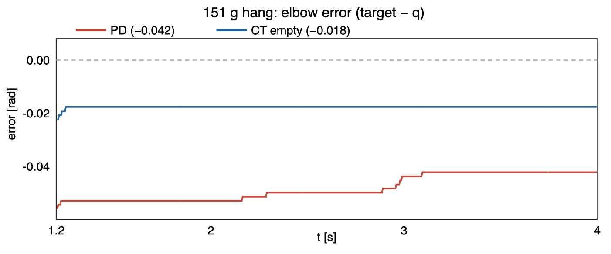

# Payload-adaptive tracking: sim to SO-ARM101 hardware

**Sim-to-real:** MuJoCo payload RLS recovers 102% of the computed-torque RMS
gap; on the STS3215 bus the same `q̈` identity is false (`raw_mass = −0.175 kg`).
Hardware path is rest-current ID, freeze, track. The latest four-mass campaign
has a **2.31× raw scale**; affine correction gives **+8.0 g (4.4%)** on an
independent 181 g repeat, with **14.6 g (8.1%)** two-run spread. Tracking-null
on 70 g straddles truth: elbow **0.058 kg**, lift **~0.155 kg** (0.070
physical); elbow is the one joint with identified `K_servo`.

## Baseline reference metrics

Naive PD (`ki = 0`, no gravity/dynamics compensation) driving a single
step-to-setpoint move. These are the references every later controller is
measured against.

### Primary metrics (the droop that later phases remove)

The phenomenon we study is the **steady-state gravity droop** -- the residual
error once the arm has settled -- plus the Cartesian end-effector miss. A
step-to-setpoint RMS over the whole run is dominated by the ~0.5 s rise (how far
each joint travelled), not the droop, so it is kept only as a secondary transit
check below. Steady-state = RMS over the settled window (`t > 1 s`); final
offset = signed `target - final` (the sag).

| Plant | Script | DOF | Steady-state arm RMS [rad] | EE miss [m] |
|-------|--------|-----|----------------------------|-------------|
| 2-link arm (concept bootstrap) | `run_baseline.py` | 2 | -- (see full RMS below) | 0.0262 |
| SO-101 / SO-ARM100 (current plant) | `run_baseline_so101.py` | 5 arm + gripper | mean 0.0100 | 0.0140 |

SO-101 per-arm-joint steady-state droop (`t > 1 s`):

| | shoulder_pan | shoulder_lift | elbow_flex | wrist_flex | wrist_roll |
|-|--------------|---------------|------------|------------|------------|
| RMS [rad] | 0.0005 | 0.0198 | 0.0195 | 0.0062 | 0.0039 |
| final offset [rad] | +0.0001 | -0.0201 | -0.0189 | -0.0071 | +0.0021 |

The droop concentrates on the gravity-loaded joints (`shoulder_lift`,
`elbow_flex`, `wrist_flex`); `shoulder_pan` / `wrist_roll` have near-vertical
axes (~0 gravity torque) so they show essentially no droop. This is the
empty-arm baseline. Phase 4 adds a known payload (droop gets worse) and
shows computed torque recovering it; Phase 5 repeats the loaded case without
giving the payload mass to the model.

### Secondary metric (transit / "did it reach the setpoint" check)

Full-window joint RMS [rad] -- transient-dominated, not the droop story:

| Plant | Arm-joint RMS [rad] | arm mean |
|-------|---------------------|----------|
| 2-link arm | 0.1119, 0.0858 | -- |
| SO-101 | 0.0932, 0.1054, 0.1304, 0.0693, 0.0598 | 0.0916 |

(SO-101 held gripper, full-window RMS: 0.0002 -- excluded from the arm metric.)

### Notes

- The SO-101 is the plant for everything from Phase 1.5 onward; `arm2.xml` /
  `run_baseline.py` stay as the documented concept bootstrap.
- SO-101 motors use the real STS3215 torque envelope (+/-2.94 N.m); it was not
  widened to make PD work. Gravity torques on this light arm are modest
  (`shoulder_lift` ~0.8 N.m at the target pose), so the empty-arm droop is small
  by design.
- Plots (`baseline_tracking.png`, `baseline_so101_tracking.png`) are gitignored;
  regenerate with the scripts above.

## Phase 4 — Pinocchio computed torque

Phase 4 uses the same 1.0 s minimum-jerk reference for PD and computed torque.
The settled window begins at 1.5 s. Computed torque uses acceleration-domain
gains `Kp=400 s^-2`, `Kd=40 s^-1` (critically damped, natural frequency
20 rad/s), with the real +/-2.94 N.m actuator limit unchanged.

Rigid-body equivalence is a blocking test before controller execution:

- Empty and known-payload pairs both pass gravity, nonlinear-bias, and full
  mass-matrix comparisons at five poses and two nonzero velocity vectors.
- Worst empty-model differences: gravity `5.55e-16 N.m`, nonlinear bias
  `8.66e-13 N.m`, mass matrix `5.64e-12` absolute.
- Worst known-payload differences: gravity `1.33e-15 N.m`, nonlinear bias
  `8.66e-13 N.m`, mass matrix `5.64e-12` absolute.
- The 0.20 kg known payload reaches `1.546 N.m` worst holding torque in the
  gate pose set: 52.6% of the actuator limit, leaving transient headroom.

Empty-arm result:

- PD settled arm-mean RMS: `0.009959 rad`; computed torque: `0.002933 rad`
  (70.5% reduction).
- PD end-effector miss: `0.014012 m`; computed torque: `0.000327 m`
  (97.7% reduction).
- Computed torque settles inside 0.01 rad by 1.225 s, with zero saturated
  samples and `1.360 N.m` peak torque.

Known-payload result (the same payload is present in MuJoCo and Pinocchio):

- PD settled arm-mean RMS: `0.021612 rad`; computed torque: `0.002840 rad`
  (86.9% reduction).
- PD end-effector miss: `0.029999 m`; computed torque: `0.000184 m`
  (99.4% reduction).
- The payload more than doubles PD's Cartesian miss, while computed torque
  returns to the Coulomb-friction floor. It settles inside 0.01 rad by 1.235 s,
  with zero saturated samples and `1.923 N.m` peak torque.

The structural result is gravity cancellation, not a gain bake-off: plain PD
must retain position error to generate holding torque, while computed torque
provides the modeled gravity torque at zero error. Remaining steady-state error
is the MuJoCo `frictionloss` deadband; damping and armature affect only the
transient. Transient metrics are still reported by `tools/phase4_bench.py`, but
they are supporting evidence because the two controllers use different-domain
gains.

This is a perfect-knowledge result. The known-payload computed-torque case is
Phase 5's upper bound. The runs below omit the payload from Pinocchio, show the
resulting degradation, then recover toward this result with online estimation.

## Phase 5 — Online payload-mass estimation

Phase 5 keeps the payload's attachment pose and inertia shape as a known
template but treats its scalar mass as unknown. A real-time scalar RLS
estimator uses the exact per-kilogram inverse-dynamics regressor
`(ID_0.20kg - ID_empty) / 0.20`. Constant-mass runs use plain RLS
(`lambda = 1`).

The regression is causally aligned: torque `tau[k-1]` is paired with
`qdd_meas[k-1] = (qdot[k] - qdot[k-1]) / dt`, evaluated at the stored
`q[k-1], qdot[k-1]`. Estimation uses this raw measured acceleration; control
uses the separate known acceleration command
`qdd_des + Kp*error + Kd*error_rate`. A deterministic synthetic test detects
an intentional one-sample skew.

Tracking results on the same 1.0 s minimum-jerk reference:

| Payload / controller model | Settled arm RMS [rad] | EE miss [m] | Peak torque [N.m] |
|----------------------------|-----------------------|-------------|---------------------|
| 0.10 kg / empty, no estimator | 0.008030 | 0.010438 | 1.640 |
| 0.10 kg / empty + RLS | 0.002494 | 0.000877 | 1.637 |
| 0.20 kg / empty, no estimator | 0.015351 | 0.020944 | 1.917 |
| 0.20 kg / empty + RLS | 0.002545 | 0.000646 | 1.919 |
| 0.20 kg / known-payload upper bound | 0.002840 | 0.000184 | 1.923 |

At 0.20 kg, RLS recovers **102.36% of the steady-state RMS gap** and
**97.77% of the Cartesian miss gap** toward the Phase 4 perfect-model bound.
The RMS recovery slightly exceeds 100% because the remaining Coulomb-friction
deadband differs between trajectories; it is not evidence that estimated
dynamics are more accurate than perfect model knowledge. All adaptive runs
have zero saturated samples and bounded final speed.

Mass-identification diagnostics:

| Plant mass [kg] | Raw final estimate [kg] | Empty-bias corrected [kg] | Corrected error [kg] | Convergence [s] |
|-----------------|-------------------------|---------------------------|----------------------|-----------------|
| 0.00 | -0.009628 | -- | -- | 2.395 |
| 0.10 | 0.093058 | 0.102685 | 0.002685 | 2.735 |
| 0.20 | 0.192716 | 0.202344 | 0.002344 | 1.995 |

The negative empty-arm estimate is the measured friction/damping model-bias
floor. The controller projects the mass used for compensation into the
physical range, so it applies 0 kg compensation on the empty arm while
retaining the signed raw estimate for diagnostics. Subtracting the empty-arm
bias is approximate: friction is velocity-dependent, so common-mode
cancellation relies on the matched reference and similar velocity profiles.
The measured adaptive-to-empty velocity RMS differences are 0.003376 rad/s
(0.10 kg) and 0.005475 rad/s (0.20 kg).

The characterization's worst corrected mass error was 0.002685 kg. The
automated gate is frozen at 0.0035 kg, approximately 30% margin, rather than
being chosen before measurement. `tools/phase5_bench.py` also retains 50% gap
recovery only as a bug-detection floor; the measured recovery above is the
reported result.

## Phase 6 — Momentum DOB (sim only, incomplete)

The archived sweep (`phase6_frequency_response.csv`) gives DOB / baseline RMS
ratios **0.108 / 0.400 / 0.448** at **0.5 / 2 / 12 Hz**. These do not trace a
first-order rolloff at the configured `dob_bandwidth_hz = 8.0`: 2 Hz is worse
and 12 Hz better than that corner predicts, and the discrepancy is unresolved.
Phase 6 was never integrated into the retained benchmark suite and never
reached hardware. It is a deliberate scope cut.

## Phase 3 — PREEMPT_RT wakeup jitter

Measured 2026-08-20 on the Ubuntu 26.04 box (i7-7700, 16 GB) after Phases 4–5.
`ubuntu-realtime` 1.1.3 installed from resolute/main (`apt install ubuntu-realtime`;
no Ubuntu Pro). Running kernel `7.0.0-30-realtime` with `PREEMPT_RT`. Generic
baseline was `7.0.0-14-generic` (`PREEMPT_DYNAMIC`).

`cyclictest -p 80 -t 1 -m -i 1000` (20k idle loops, 60k under `stress-ng`
cpu+io+vm):

| Kernel / load | Min [µs] | Avg [µs] | Max [µs] |
|---------------|----------|----------|----------|
| generic idle | 2 | 2 | 4 |
| realtime idle | 2 | 2 | 6 |
| realtime loaded | 2 | 2 | 27 |

In-repo bench `rt_jitter_bench` (`mlockall`, `SCHED_FIFO` 80, absolute
`clock_nanosleep(CLOCK_MONOTONIC, TIMER_ABSTIME)`), same periods:

| Load | n | Min | Avg | p99 | p99.9 | Max |
|------|---|-----|-----|-----|-------|-----|
| idle | 20000 | 2.20 | 2.43 | 2.88 | 3.34 | **6.89** |
| loaded | 60000 | 2.22 | 3.38 | **6.18** | **11.34** | 438 |

Idle Max matches cyclictest. Loaded **p99 / p99.9** are the operational numbers
(6 / 11 µs). Loaded Max 438 µs is ~43/60000 ticks (0.07%); at 200 Hz (5 ms)
those ticks still meet the period. `cyclictest` saw only 27 µs under the same
`stress-ng` load, so it did not reproduce the outlier and an application-side
cause in `rt_jitter_bench` is not excluded.

A first bench using `std::this_thread::sleep_until` produced idle Max 477 µs
and is discarded: libstdc++ can wait with relative `nanosleep`. That was not a
kernel number.

Quote for later phases: idle Max **7 µs**, loaded p99 **6 µs**. USB-serial in
Phase 7 will be milliseconds; OS wakeup is not the sim-to-real bottleneck.

Raw `late_us` CSV was not archived; the figure is the table above (log µs)
plus a 5000 µs period line. Regenerate: `python3 tools/plot_results_figures.py`.

Tools: [`ros2_ws/src/arm_control/src/rt_jitter_bench.cpp`](ros2_ws/src/arm_control/src/rt_jitter_bench.cpp),
[`tools/jitter_hist.py`](tools/jitter_hist.py),
[`tools/plot_results_figures.py`](tools/plot_results_figures.py).

## Phase 7 — SO-ARM101 hardware, matched-rate min-jerk

Follower: ThinkRobotics SO-ARM101, 6× STS3215 on `/dev/ttyACM0` (WCH 1a86).
`f_hw = 200 Hz` (`dt = 0.005`), same as `so101_torque.xml`. Bus RTT (2000
loops, zero loss): sync_read p99.9 1.71 ms, sync_write p99.9 0.19 ms, I/O
together ~1.90 ms (~38% of the 5 ms period). `bus_timeout_ns = 5_130_000`.
Read is ~9× write, more than packet size alone explains. Per-servo Return
Delay Time (register 7) is the likely dominant term, but was not verified.

Tick→rad gate at calibrated `q = 0`: model EE (MuJoCo) x=39.1 cm, y≈0,
z=24.6 cm; ruler x≈39 cm, y=0, z≈27 cm. Signs were not inverted.

The STS3215 has no closed-loop N·m mode. The first tracking run that counts
is **position streaming**: after a min-jerk home to calib zero, `hardware_run`
writes the same 1.0 s min-jerk `q_des` as Goal_Position (Mode 0). That uses
the servo's inner PD. An outer `τ = Kp e + Kd ė` bridge is not this number.

Calibration (`so101_follower_calib.json`, mid-range = `q = 0`, then both
mechanical stops). Arm joints have ~±1.3–2 rad of recorded range. Lift's
`min_ticks=0 max_ticks=4095` is an encoder wrap during the sweep; it does not
clip this `kTarget`. Gripper is held at `q = 0` in software.

Home before the stream: `q = (0.006, 0.006, 0.044, 0.017, 0.029, 0.006)`.

Matched comparison, empty arm, `kTarget = (0.6, 0.7, -0.8, 0.5, 0.4, 0)`,
1.0 s min-jerk, 4.0 s log, 200 Hz, 800 samples. Sim is existing
`cpp_pd_empty_smooth.csv` (naive PD on the torque plant).
Hardware is `docs/data/hw_pd.csv` from the position-stream run. Settled
window `t ≥ 1.5 s`, five arm joints (gripper excluded).

| | pan | lift | elbow | wrist flex | wrist roll | arm mean |
|-|-----|------|-------|------------|------------|----------|
| sim PD SS RMS [rad] | 0.0004 | 0.0198 | 0.0196 | 0.0060 | 0.0041 | **0.0100** |
| hw stream SS RMS [rad] | 0.0063 | 0.0056 | 0.0453 | 0.0015 | 0.0272 | **0.0172** |
| hw final offset [rad] | +0.006 | −0.006 | −0.045 | +0.002 | +0.027 | |

Hardware final `q = (0.594, 0.706, −0.755, 0.499, 0.373, 0.006)`. The stream
settles by ~1.2 s and holds. This is **not** PD-vs-PD: sim must keep position
error to hold gravity (lift/elbow droop ~0.02 rad); the real servos hold lift
tighter and leave more elbow/wrist-roll miss.

Full-window RMS vs the time-varying min-jerk (transit, not droop): sim arm
mean 0.0173 rad, hardware 0.0567 rad — the real arm lags the 1 s reference
more than sim PD.

Ubuntu 26.04 has no `libpinocchio-dev`. FK, computed torque, and the payload
estimator run in `so101-dev:jazzy` (`ros-jazzy-pinocchio`) on the i7. After
that, `hardware_run` logs Pinocchio EE from measured `q`.

### Torque-to-position bridge and `K_servo`

STS3215 Mode 0 cannot take N·m. Controllers still emit `τ`; the runner
realizes `q_cmd = q_des + clamp(τ / K_servo, ±max_lead)` with
`K_servo = (50, 90, 11, 50, 50, 50)` N·m/rad. **Only elbow is identified**
(`K ≈ 11` from `g(q)/offset` on a settled stream). Lift is too stiff to
estimate from droop (`K = 90` is a placeholder). Wrist-roll `g/offset` was
garbage (`K ≈ −0.2`); `g_roll ≈ 0` so the placeholder is harmless, as is
pan. **Wrist_flex has real gravity torque** and its overlay is scaled by an
arbitrary `K = 50`. Gravity-compensation headlines sit on elbow, the one
joint with a measured stiffness. The other entries are frozen placeholders,
not a calibrated map. Elbow `K ≈ 11` vs lift `K = 90` is physically odd for
nominally identical servos; whether all six units share one gear ratio was not
verified.

An outer PD on that bridge is a second position loop on top of the servo PD.
`q_cmd = q_des + (Kp/K) e` has discrete pole `z = −Kp/K`. Sim gains
`Kp_elbow = 25` give `25/11 ≈ 2.3` (unstable, clipped by `max_lead = 0.12 rad`)
and lift `40/90 ≈ 0.44` hunts. A 151 g PD run with those gains reached
`q = (0.598, 0.718, −0.795, 0.499, 0.373)` but bounced at the hold; that CSV
is discarded. Hardware gains were dropped to `Kp = (8, 12, 2, 8, 8, 0)`,
`Kd = 0` (tick `qdot` is not a velocity), and CT acceleration gains to
`Kp = 40 s^-2`, `Kd = 4 s^-1`. Home uses `acc=30`, uncapped speed. Tracking
streams the min-jerk with `acc=0`, `speed=0`: a non-zero accel restarts its
ramp on every 5 ms Goal_Position rewrite and crawls (~0.06 rad/s at
`speed=40`, missing `kTarget` in 4 s).

### 151 g payload: PD vs CT vs motion RLS

Physical hang **151 g** from the closed gripper (`min_ticks`, empty-jaw
`q_g ≈ −0.241 rad`). RLS template mass in the payload URDF is still
**0.20 kg**. Same `kTarget`, 1.0 s min-jerk, 4.0 s log, 200 Hz. CT uses the
empty URDF (deliberate mismatch). Adaptive first used the Phase 5 `q̈` RLS.
Final pose vs `kTarget` (signed `target − q`, five arm joints). Wrist-roll
is **~0.027–0.029 rad in every hardware controller**: `K_servo[4]` is a
placeholder and `g_roll ≈ 0`, so no overlay moves it. That constant sits in
the 5-joint RMS and dilutes the gravity-joint result. RMS (no roll) is the
four joints a controller can actually move. The ~0.027 rad roll offset is
~18 encoder LSB on a gravity-free joint; a calibration offset is not ruled
out.

| | pan | lift | elbow | flex | roll | RMS (5) | RMS (no roll) | EE z [m] |
|-|-----|------|-------|------|------|---------|---------------|----------|
| PD (stable) | +0.005 | −0.021 | **−0.042** | 0.000 | +0.027 | 0.025 | **0.024** | 0.132 |
| CT empty | +0.006 | −0.013 | **−0.018** | +0.005 | +0.029 | 0.017 | **0.012** | 0.143 |
| adaptive (`q̈` RLS) | +0.005 | −0.013 | **−0.019** | +0.005 | +0.029 | 0.017 | **0.012** | 0.142 |

CT empty vs PD: **32%** better on 5-joint RMS (0.025 → 0.017), **50%** better
with wrist-roll dropped (0.024 → 0.012). Same data; the 5-joint number
understates the gravity-compensation result. EE (x, y) ≈ (0.379, −0.226) m
on all three.

PD elbow sag happens to match the empty position-stream miss (~0.045 rad),
despite the different payload and control law; it is not evidence that 151 g
caused no degradation. CT’s `g(q)/K` overlay closes most of it
(0.042 → 0.018 rad). Wrist-roll does not move. Adaptive tracking is empty CT
to three digits:

`raw_mass = −0.1753 kg`, `compensated = 0.0000 kg`, 799 RLS updates.

`compensated = 0` is the projection clamp (`m ∈ [0, 0.5]`) catching a
nonsense estimate and **degrading to CT-empty** instead of injecting negative
mass. That is the safety layer working. The estimator that recovered
**102% of the RMS gap in sim** produced **−0.175 kg on hardware**. The
sim-to-real gap showed up in the estimator, not in a second tracking-error
bake-off.

Logs: `docs/data/hw_pd_151.csv`, `docs/data/hw_ct_151.csv`,
`docs/data/hw_adapt_151.csv`.

The figure also exposes slow PD drift inside the nominal settled window:
elbow error moves from **−0.053 rad at 1.5 s to −0.042 rad at 4.0 s**
(~0.011 rad in encoder-LSB steps), while CT stays at **−0.0177 rad**. Thus
PD RMS is somewhat window-dependent, although the PD–CT gap is larger than
the drift. Candidate causes are slow integral action in the STS3215 inner
loop or gradual stiction release; bridge walk is unlikely because
`Kp_elbow / K_servo = 2/11 ≈ 0.18` is comfortably stable.

### Why hardware `q̈` RLS is the wrong equation

Phase 5 RLS solves `τ_applied − ID_empty(q, q̇, q̈) = Φ(q, q̇, q̈) · m` on a
torque plant. Four independent failures make that identity false on this bus.

1. **`τ` is not plant torque.** The residual uses `previous_applied_torque`,
   which is the Goal_Position overlay (`~g(q)`, lift ≈ 0.8 N·m). The STS3215
   inner PD produces the torque that actually holds the arm. The RLS `τ` and
   the physical `τ` are different signals.

2. **`q̈` from 12-bit ticks.** One encoder LSB is `2π/4096 = 1.534×10^-3 rad`.
   At `dt = 0.005 s`, a 1-tick hold twitch is `q̇ = 0.307 rad/s` and
   `q̈ = 61.4 rad/s²`. True hold acceleration is ~0. `q̇` is a position
   difference, not a measured velocity; `q̈` is that difference again.

3. **Fake inertia swamps gravity in `ID_empty`.** Pinocchio joint armature is
   0.028 N·m·s²/rad, so one LSB of `q̈` injects at least
   `0.028 × 61.4 = 1.72 N·m` of inertia torque on every joint — already
   **2.1×** empty lift gravity (0.80 N·m) and **3.7×** elbow gravity
   (0.47 N·m). A single noisy sample of the residual is then
   `extra ≈ 0.8 − (1.72 + 0.8) ≈ −1.7 N·m` (wrong sign). 799 updates
   integrate that.

4. **Friction floor, scaled up.** Sim empty-arm raw mass was **−0.0096 kg**
   (Phase 5 bias). Hardware raw mass is **−0.175 kg**, about **18×** that
   floor, with Coulomb friction and the inconsistent `(τ, q̈)` pair on top.
   The signed raw value is the diagnostic; the clamp kept control at 0 kg.

Causes 2–3 vanish at rest (`q̇ = q̈ = 0`). Cause 1 does not: overlay `τ` is
still not motor torque.

### Static gravity identification (Present_Current)

At rest `τ = g_empty(q) + Φ_g(q) · m + f_coulomb`. `τ` is Present_Current
(SMS/STS register **69**, sign-magnitude, datasheet 6.5 mA/LSB), not
`K_servo · δq` and not register **60** (Present_Load, PWM duty). Gripper
current is dropped from the residual. `--payload-g` is a log label only; it
is not an input to the estimator. `Φ_g = (g_{0.20 kg URDF} − g_empty) / 0.20`
is the per-kilogram gravity regressor (attachment pose known, scalar mass
unknown). The 6.5 mA LSB is the Feetech figure; it was not checked against a
locked-rotor ammeter at the 2.94 N·m stall.

Empty-arm `k_t` fit (pooled lift/elbow/flex): **`k_t = −12.5223 N·m/A`**.
All six `calib.sign = +1` (FK matched the ruler; this is not an unresolved
encoder flip). Present_Current’s sign bit is opposite Pinocchio `τ` on the
gravity joints, so the empty LS is negative — motor-current polarity vs
joint frame. Passing `--kt -12.5223` with `sign = +1` is that convention.
Do not refit `k_t` with a mass in the jaws.

The **magnitude** is the informative part. A physical joint-level `k_t` would
be stall torque over stall current. Feetech quotes **~2.94 N·m**; stall
current **~2.5–3 A is not measured here** (neither is the 6.5 mA LSB). If
that current is right, physical `k_t` is ~1.1 N·m/A and the fit (~12.5) is
~10× large — gearbox friction holding static load, motor drawing less than
`τ / (n η K_t)`. If stall current were instead ~0.3 A, `k_t ≈ 10 N·m/A` is
near the fit and the friction-inflation story is wrong. One locked-rotor
test (clamp a joint, ramp PWM, read reg 69 and an inline ammeter) settles
both the LSB and stall current. Until that run, the 10× claim is a
hypothesis, not a measurement. Keep the same fitted `k_t` on loaded runs
(it is an instrument scale, not the motor constant).

`gravity_id` (six high poses, approach ±0.07 rad from both sides, 151 g cup
hanging by the handle): LS mass **0.290 kg** vs hang **0.151 kg** (~1.9×).
Early poses with EE z ≈ 6 cm planted the cup on the table and were replaced
by holds with EE z ≳ 0.22 m.

A 3 s hold at `kTarget` with `λ = 0.99` on raw 200 Hz current gave
**0.003 kg** and is discarded: one pose, forgetting, no two-way average.

Hanging-COM error: the 9 cm cup sits below the URDF payload frame, so `Φ_g`
is too small and `m` comes out high. A **70 g object held in the jaws** is
**assumed** to sit at that frame (grasp-point offset was not measured). That
assumption is what makes 70 g the fairer current-ID comparison than the
hanging cup.

Home-id at `q ≈ 0` is ill-conditioned (`Φ_g ≈ 0`); all mass readings from
that pose are discarded. `hardware_run` now IDs at `kTarget` (1-pose
two-way, below). One hang run froze **m = 0.239 kg** from home-id
(`docs/data/hw_adapt_151.csv`) — not a mass, but it is the compensation
that was applied, and tracking-null uses it only as that. 70 g home-id
values (0.0625 kg at 100% pinch; −0.13 kg at 20%) are unused.

### 1-pose two-way ID at `kTarget` (in-run, ~8 s)

`hardware_run` adaptive path: after home, one hold at `kTarget`, approach
±0.07 rad on lift/elbow/flex, average Present_Current, freeze `m`, return
home, then the 4 s min-jerk. `updates = 0` during tracking. Gripper 20%.

| | physical [kg] | ID m [kg] | vs empty | final q (lift, elbow) |
|-|---------------|-----------|----------|------------------------|
| empty, jaws closed | 0.000 | **0.0308** | — | 0.695, −0.807 |
| 70 g in jaws | 0.070 | **0.1289** | **0.0981** | 0.701, −0.816 |

Empty should be 0. **0.031 kg** is the floor at this pose (URDF vs
`k_t · I`, leftover stiction). Loaded **0.129 kg** is bias + payload.
Incremental **0.098 kg** vs 0.070 is **+40%**. Same ~1.8× absolute scale as
the hanging-cup 6-pose LS before empty subtraction. This earlier two-point
scale (~1.4× incremental) is superseded by the four-mass fit below. Using
half the later 181 g repeat spread as a rough per-point variation gives about
±0.34 uncertainty on a slope measured over only 70 g; it was never an
independent competing calibration.

Tracking, signed `target − q`, same `kTarget`:

| | pan | lift | elbow | flex | roll | EE z [m] |
|-|-----|------|-------|------|------|----------|
| adaptive empty, m=0.031 | +0.006 | +0.005 | +0.007 | +0.008 | +0.027 | 0.157 |
| adaptive 70 g, m=0.129 | +0.005 | **−0.001** | **+0.016** | +0.008 | +0.027 | 0.157 |
| CT empty, 70 g (no ID) | +0.005 | −0.006 | **−0.013** | +0.005 | +0.029 | — |

On hardware, adding 70 g shifts elbow error by **0.020 rad**: +0.007 for the
empty arm (adaptive path, `m = 0.031`) to −0.013 with 70 g and no payload
compensation. Applying the current-identified `m = 0.129` moves it to +0.016,
overshooting in the direction expected from the estimator’s **+84% absolute
bias**.

### Tracking-null mass (independent of current)

Linear interpolate each joint’s signed `target − q` to zero offset
(`m_null = m_hi · |e_0| / (|e_0| + |e_hi|)` when the two errors straddle
zero; otherwise extrapolate). Gravity torque is linear in `m`; **stiction
deadband is not**, so near-zero error the curve can flatten. Two points
cannot show that.

70 g (CT empty `m = 0` vs 1-pose freeze `m = 0.129`):

| joint | e(m=0) | e(m=0.129) | m_null [kg] | physical 0.070 |
|-------|--------|------------|-------------|----------------|
| elbow | −0.013 | +0.016 | **0.058** | −17% |
| lift | −0.006 | −0.001 | **~0.155** (no zero in range) | +121% |

Elbow and lift **straddle** 0.070 by ~3×. Elbow is the more trustworthy
null: it is the only joint with identified `K_servo = 11`. Lift’s overlay
uses placeholder `K = 90`, so its error-vs-`m` slope is arbitrary. Wrist_flex
stayed positive (+0.005 → +0.008) and has no null.

151 g hang (CT empty vs applied freeze `m = 0.239`). **0.239 kg enters here
only as the applied compensation, not as a mass claim.**

| joint | e(m=0) | e(m=0.239) | m_null [kg] |
|-------|--------|------------|-------------|
| elbow | −0.018 | +0.028 | 0.094 |
| lift | −0.013 | −0.007 | does not null in range (~0.52 extrapolated) |

Elbow 0.094 kg vs hang 0.151 kg is an equivalent mass at the **URDF
payload frame**; the cup COM is 9 cm below, so it should read low.

The gravity-compensation **shape** on elbow is close enough to bracket
70 g; the current-based 0.129 kg (+84%) is the biased instrument. Lift
does not confirm that at the same tolerance, and is not the identified-K
joint. Numbers are from `docs/data/hw_ct_70.csv` /
`docs/data/hw_adapt_70.csv` and `docs/data/hw_ct_151.csv` /
`docs/data/hw_adapt_151.csv`.

### Affine current-ID calibration

One 1-pose two-way run at `kTarget` (same ±0.07 approach protocol) at each of
0, 90, 181, and 273 g (20% pinch) gives:

| true [kg] | raw ID [kg] | affine-corrected [kg] | corrected error [g] |
|-----------|-------------|-----------------------|---------------------|
| 0.000 | −0.00868 | 0.00164 | +1.64 |
| 0.090 | 0.19758 | 0.09085 | +0.85 |
| 0.181 | 0.39084 | 0.17443 | −6.57 |
| 0.273 | 0.62816 | 0.27707 | +4.07 |

Least squares:

`m_raw = 2.31217 · m_true − 0.01248 kg`

so the calibrated estimate is

`m_cal = (m_raw + 0.01248 kg) / 2.31217`.

The in-sample corrected RMSE is **3.97 g**, but that divides residual SSE by
all four fitted points. With `n = 4`, `p = 2`, the residual standard error is
**5.62 g** (`sqrt(SSE / (n − p))`); maximum fit residual is **6.57 g**.
`R² = 0.99848` is expected for a roughly linear signal over 0–273 g and is
less informative than residuals and repeatability.

An independent repeat at 181 g (not refit) returned raw **0.4246 kg**:
the affine map gives **0.1890 kg**, an **+8.0 g validation error**. The two
181 g raw estimates differ by 0.0338 kg, equivalent to **14.6 g** after
calibration. This is **repeat-run validation at a fitted mass**, not
generalization to an unseen mass: +8.0 g is about half the 14.6 g spread and
is consistent with run noise. A true held-out interpolation test needs a fifth
mass not used in the fit (roughly 130 g would sit between fitted points). The
defensible headline is therefore **4.4% repeat-run error with an 8.1% two-run
spread**, not the 3.97 g in-sample RMSE. This is a single-digit-percent result;
labeling it “research-grade” would require a cited, protocol-matched external
benchmark.

The four fit residuals are in-sample and each calibration mass was run once.
Gripper position changed systematically
(−0.232, −0.172, −0.081, +0.020 rad) as weights were stacked; its correlation
with mass is **r = 0.994**. Mass and attachment geometry are therefore nearly
perfectly collinear: this affine map belongs to this stacking geometry and
should not be assumed to transfer to a differently shaped object. A future
calibration should hold jaw opening and object footprint fixed while changing
internal weight.

The 273 g raw estimate exceeded the controller’s 0.5 kg compensation clamp;
the unclamped **0.62816 kg diagnostic** is what enters the fit. On the current
uncorrected runtime path, raw 0.5 kg corresponds through the affine map to
**0.222 kg true mass**. Above ~222 g the controller under-compensates even if
the raw ID follows this fit. Applying the affine correction before the
physical-mass clamp would remove that artificial limit.

The prior 70 g campaign’s ~1.4× incremental scale and this campaign’s 2.31×
scale used the same `kTarget` protocol but different sessions and stacking
geometry. Their disagreement is consistent with the earlier warning that an
apparent, friction-inflated `k_t` is not constant with load and approach, but
the geometry collinearity prevents attributing the change to `k_t` alone.

Logs: `docs/data/hw_id_000.csv`, `docs/data/hw_id_090.csv`,
`docs/data/hw_id_0181.csv`, `docs/data/hw_id_0181_repeat.csv`,
`docs/data/hw_id_0273.csv`.

**Status.** Sim Phases 4–5 and the hardware plant (bridge, `K_servo`,
Present_Current `k_t`, rest-ID then freeze) are done. Hardware does **not**
recover Phase 5 online `q̈` RLS; mass during motion stays frozen. Current-ID
raw scale is ~2.31× in this four-mass stacking geometry; affine correction
gives **+8.0 g (4.4%)** repeat-run error at 181 g and **14.6 g (8.1%)**
two-run spread; unseen-mass interpolation is not yet tested. Elbow
tracking-null on 70 g is 0.058 kg; lift says ~0.155 kg. Highest-value
remaining hardware is the **locked-rotor** check (reg 69 vs ammeter + stall
current), followed by fixed-geometry repeatability. Variable load in one
tracking run is out of scope. Phase 6 (momentum DOB) remains sim-only,
incomplete, and unresolved at its configured 8 Hz corner.